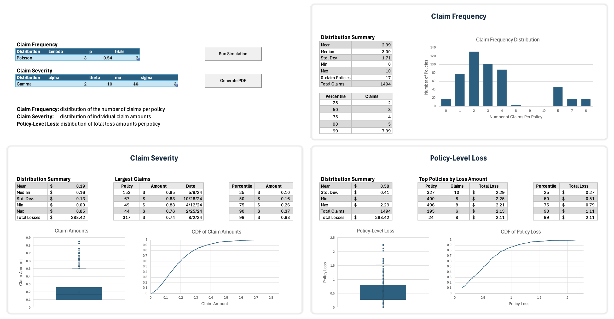

# Overview
This project lets you run and visualize basic claim frequency/severity simulations in Excel using VBA and R.
**Note: This project requires macOS** because it uses VBA's AppleScriptTask method for VBA-to-R integration.

## Requirements
- Microsoft Excel with VBA enabled
- Mac (Windows is not supported due to the use of AppleScriptTask in VBA)
- R (with the "rstudioapi" installed **if** you want to run the simulation script manually)

## Installation / Setup
1. Run the setup script (claimsSim/setup.sh)
    - The setup script copies an AppleScript (runRScript.scpt - the compiled version of runRScript.applescript) to a directory Excel looks in when the AppleScriptTask method is used in VBA.
2. Open ClaimsAnalysis.xlsm
    - Click "Enable Macros"
    - Click "Enable Content" on the warning that says "Security Warning External Data Connections have been disabled"
    - Launch the powerquery editor, then:
        1. Click "Options"
        2. Under "Project", click "Privacy" and check "Allow combining data from multiple sources. This could expose sensitive or confidential data to an unauthorized person"
        3. Click "Okay"
3. Go to the "Settings" sheet and:
    - Update the Rscript path to be where Rscript is installed on your computer
        - To find this, run ```which Rscript``` from your terminal
        - If this returns "Rscript not found", then you'll need to install it (https://cran.r-project.org/bin/macosx/). Once it's installed, run ```which Rscript``` to see where Rscript is on your computer, and then update the "Rscript path" setting in the spreadsheet if it's different
    - Optional: Adjust the "Max Claim Amount" setting (claims exceeding this will be capped)
    - "Num Policies" is currently hardcoded in the simulation script to **500**, so this setting is not adjustable. Future support for this is planned.
4. On the Dashboard sheet, fill out the Frequency and Severity distribution tables in the top-left.
5. Click **Run Simulation.**
    - An R script will run to generate simulated claims data and save it to a csv.
    - PowerQuery will then load the csv and process it
    - The dashboard will then update
6. (Optional) Click **Generate PDF** to export the dashboard as a PDF.

## Dashboard Output
There are 4 sections on the dashboard:
- Inputs: Distribution parameters for claim frequency and severity
- Frequency
    - Bar chart displaying the Probability Distribution of claim counts per policy.
    - Distribution Summary (Note: "0-claim Policies" refers to the number of policies that had 0 claims)
    - Percentiles (configurable)
- Severity
    - Boxplot and Cumulative Distribution Function (CDF) charts of claim amounts
    - Distribution summary (Note: the "Total Losses" statistic is the total claim amount across all policies)
    - Largest claims: Top 5 largest individual claims, along with Policy ID and Claim Date
    - Percentiles (configurable)
- Policy-Level Loss
    - Boxplot and CDF chart of total losses per policy.
    - Distribution summary
    - Top Policies by Loss Amount: Top 5 policies with the highest total losses
    - Percentiles (configurable)

## Dashboard Preview
Here’s an example of the dashboard output:


